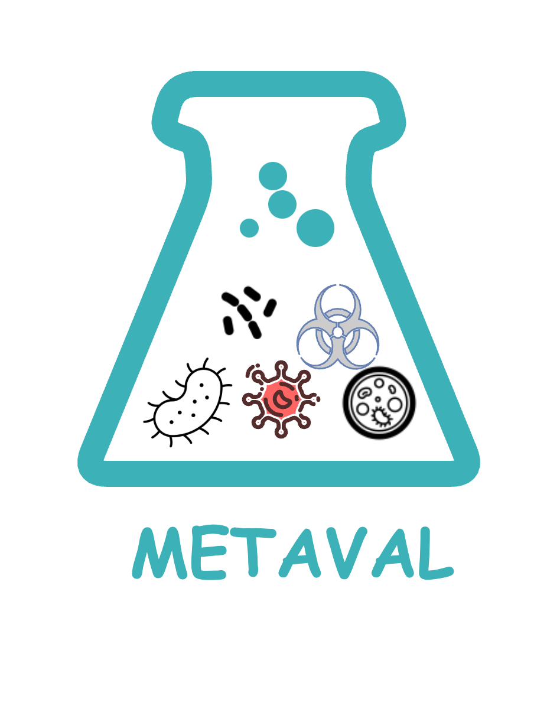

<h1>
  <picture>
    <source media="(prefers-color-scheme: dark)" srcset="docs/images/metaval_logo_dark.png">
    
  </picture>
</h1>

[](https://github.com/genomic-medicine-sweden/meta-val/actions/workflows/ci.yml)
[](https://github.com/genomic-medicine-sweden/meta-val/actions/workflows/linting.yml)
[](https://www.nf-test.com)

[](https://www.nextflow.io/)
[](https://docs.conda.io/en/latest/)
[](https://www.docker.com/)
[](https://sylabs.io/docs/)
[](https://cloud.seqera.io/launch?pipeline=https://github.com/nf-core/metaval)

## Introduction

**genomic-medicine-sweden/meta-val** is a bioinformatics pipeline for post-processing of [nf-core/taxprofiler](https://github.com/nf-core/taxprofiler) results. It verifies the species classified by the nf-core/taxprofiler pipeline using Nanopore and Illumina shotgun metagenomic data. At the moment, `genomic-medicine-sweden/meta-val` only verifies the classification results from three taxonomic classifiers `Kraken2`, `Centrifuge` and `diamond`.

The pipeline, constructed using the `nf-core` [template](https://nf-co.re/tools#creating-a-new-pipeline), utilizing Docker/Singularity containers for easy installation and reproducible results. The implementation follows [Nextflow DSL2](https://www.nextflow.io/docs/latest/dsl1.html), employing one container per process for simplified maintenance and dependency management. Processes are sourced from [nf-core/modules](https://github.com/nf-core/modules) for broader accessibility within the Nextflow community.

## Pipeline summary

<p align="center">
     
</p>

1. Extract viral taxIDs predicted by kraken2, centrifuge and DIAMOND classifiers.

2. Extract classified reads for organisms of interest, such as all identified viruses or a predefined list of organisms.

3. Use `BLAST` to identify the closest reference genome for the extracted reads.

4. Map the extracted reads to reference genomes using `Bowtie2` for Illumina reads and `minimap2` for Nanopore reads.

5. Visualize using `IGV`.

6. Perform quality check for target reads (`FASTQC` & `MultiQC`).

7. Map reads to a list of viral pathogens genomes (`Bowtie2` or `minimap2`).

## Usage

> [!NOTE]
> If you are new to Nextflow and nf-core, please refer to [this page](https://nf-co.re/docs/usage/installation) on how to set-up Nextflow. Make sure to [test your setup](https://nf-co.re/docs/usage/introduction#how-to-run-a-pipeline) with `-profile test` before running the workflow on actual data.

First, prepare a samplesheet with your input data that looks as follows:

`samplesheet.csv`:

```csv
sample,run_accession,instrument_platform,fastq_1,fastq_2,kraken2_report,kraken2_result,kraken2_taxpasta,centrifuge_report,centrifuge_result,centrifuge_taxpasta,diamond,diamond_taxpasta
sample1,run1,ILLUMINA,sample1.unmapped_1.fastq.gz,sample1.unmapped_2.fastq.gz,sample1.kraken2.kraken2.report.txt,sample1.kraken2.kraken2.classifiedreads.txt,kraken2_kraken2-db.tsv,sample1.centrifuge.txt,sample1.centrifuge.results.txt,centrifuge_centrifuge-db.tsv,sample1.diamond.tsv,diamond_diamond-db.tsv
sample2,run1,ILLUMINA,sample2.unmapped_1.fastq.gz,sample2.unmapped_2.fastq.gz,sample2.kraken2.kraken2.report.txt,sample2.kraken2.kraken2.classifiedreads.txt,kraken2_kraken2-db.tsv,sample2.centrifuge.txt,sample2.centrifuge.results.txt,centrifuge_centrifuge-db.tsv,sample2.diamond.tsv,diamond_diamond-db.tsv
```

Each row represents a fastq file (single-end) or a pair of fastq files (paired end).

Now, you can run the pipeline using:

```bash
nextflow run genomic-medicine-sweden/meta-val \
   -profile <docker/singularity/.../institute> \
   --input samplesheet.csv \
   --outdir <OUTDIR>
   --run_kraken2 --run_centrifuge --run_diamond
```

> [!WARNING]
> Please provide pipeline parameters via the CLI or Nextflow `-params-file` option. Custom config files including those provided by the `-c` Nextflow option can be used to provide any configuration _**except for parameters**_;
> see [docs](https://nf-co.re/usage/configuration#custom-configuration-files).

For more details and further functionality, please refer to the [usage documentation](https://github.com/genomic-medicine-sweden/meta-val/blob/dev/docs/usage.md).

## Test data

There are three test datasets within `assets/test_data/`, produced by the `nf-core/taxprofiler` pipeline

- `taxprofiler_test_data`: produced by executing the `test.config` file within the pipeline `nf-core/taxprofiler`.
- `taxprofiler_test_full_data`: produced by executing the `test_full.config` file within the pipeline `nf-core/taxprofiler`.
- `test_data_version2_subset`: produced by running the data downloaded from https://www.nature.com/articles/s41598-021-83812-x

The corresponding input samplesheets are stored in `assets/`

- `samplesheet_v1.csv`:results of taxprofiler test data; limited classification results; no viruses; single-end (`perform_runmerging`).
- `samplesheet_v2.csv`:results of taxprofiler full test data; no viruses; single-end (`perform_runmerging`).
- `samplesheet_v3.csv`: with viruses; subset data from `test_data_version2_subset` (sample 20% of pair-end reads).

## Headlines of input files

`kraken2_report` & `centrifuge_report`

```csv
 4.62	167021	167021	U	0	unclassified
 95.38	3445908	335	R	1	root
 95.36	3445179	323	R1	131567	  cellular organisms
 93.28	3369988	622	D	2759	    Eukaryota
 93.26	3369247	30	D1	33154	      Opisthokonta
```

`kraken2_result`

```csv
C	SRR13439790.3	9606	150|150	9606:4 0:18 9606:7 0:5 9606:15 0:19 9606:9 0:2 9606:13 33154:1 9606:9 0:9 9606:5 |:| 9606:26 0:1 9606:3 0:32 9606:2 0:10 9606:3 0:21 9606:17 0:1
C	SRR13439790.5	9606	103|103	9606:5 0:38 9606:5 0:3 9606:8 0:2 9606:8 |:| 9606:13 0:56
C	SRR13439790.7	9606	150|150	9606:60 0:4 9606:1 0:1 9606:6 0:26 9606:2 0:7 9606:9 |:| 0:5 9606:1 0:44 9606:4 0:7 9606:1 0:21 9606:20 2759:4 9606:9
C	SRR13439790.8	9606	107|107	0:3 9606:23 0:3 9606:14 0:16 9606:14 |:| 9606:3 0:51 9606:11 0:8
C	SRR13439790.9	9606	101|150	0:48 9606:1 0:18 |:| 0:8 9606:5 0:103
```

`centrifuge_result`

```csv
readID	seqID	taxID	score	2ndBestScore	hitLength	queryLength	numMatches
SRR13439790.3	NT_187391.1	9606	1624	557	109	300	1
SRR13439790.5	NC_000022.11	9606	905	169	96	206	1
SRR13439790.7	NC_000007.14	9606	6025	961	125	300	1
SRR13439790.9	unclassified	0	0	0	0	251	1
```

`diamond`

```csv
SRR13439790.3	0	0
SRR13439790.3	0	0
SRR13439790.5	0	0
SRR13439790.5	0	0
SRR13439790.7	0	0
```

## Pipeline output

For more details about the output files and reports, please refer to the
[output documentation](https://github.com/genomic-medicine-sweden/meta-val/blob/dev/docs/output.md).

## Credits

genomic-medicine-sweden/meta-val was originally written by [LilyAnderssonLee](https://github.com/LilyAnderssonLee). Additional contributors were [sofstam](https://github.com/sofstam), [lokeshbio](https://github.com/lokeshbio)

We thank the following people for their extensive assistance in the development of this pipeline:

<!-- TODO nf-core: If applicable, make list of people who have also contributed -->

## Contributions and Support

If you would like to contribute to this pipeline, please see the [contributing guidelines](.github/CONTRIBUTING.md).

For further information or help, don't hesitate to get in touch by opening an [issue](https://github.com/genomic-medicine-sweden/meta-val/issues).

## Citations

If you use genomic-medicine-sweden/meta-val for your analysis, pelase cite it using the following doi:xxxxx

<!-- TODO nf-core: Add citation for pipeline after first release. Uncomment lines below and update Zenodo doi and badge at the top of this file. -->
<!-- If you use genomic-medicine-sweden/meta-val for your analysis, please cite it using the following doi: [10.5281/zenodo.XXXXXX](https://doi.org/10.5281/zenodo.XXXXXX) -->

<!-- TODO nf-core: Add bibliography of tools and data used in your pipeline -->

An extensive list of references for the tools used by the pipeline can be found in the [`CITATIONS.md`](CITATIONS.md) file.

This pipeline uses code and infrastructure developed and maintained by the [nf-core](https://nf-co.re) community, reused here under the [MIT license](https://github.com/nf-core/tools/blob/master/LICENSE).

You can cite the `nf-core` publication as follows:

> **The nf-core framework for community-curated bioinformatics pipelines.**
>
> Philip Ewels, Alexander Peltzer, Sven Fillinger, Harshil Patel, Johannes Alneberg, Andreas Wilm, Maxime Ulysse Garcia, Paolo Di Tommaso & Sven Nahnsen.
>
> _Nat Biotechnol._ 2020 Feb 13. doi: [10.1038/s41587-020-0439-x](https://dx.doi.org/10.1038/s41587-020-0439-x).
