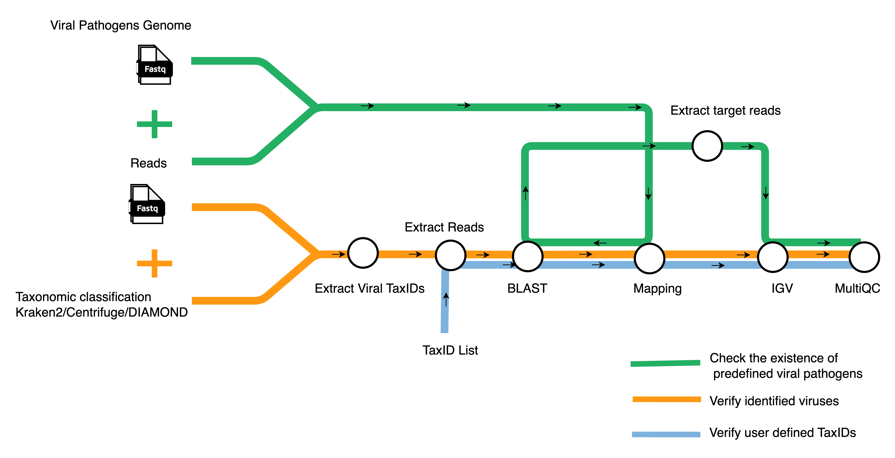
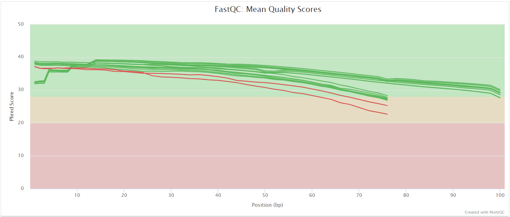

# genomic-medicine-sweden/meta-val: Output

## Introduction

This document describes the output produced by the pipeline. Most of the plots are taken from the MultiQC report, which summarises results at the end of the pipeline.

The directories listed below will be created in the results directory after the pipeline has finished. All paths are relative to the top-level results directory.

<!-- TODO nf-core: Write this documentation describing your workflow's output -->

## Pipeline overview

The pipeline is built using [Nextflow](https://www.nextflow.io/) and processes data using the following steps:

- [FastQC](#fastqc) - Raw read QC
- [Extract Viral TaxIDs](#Extract-Viral-TaxIDs) - Extract all taxonomic IDs of viral species identified by classifiers
- [Extract Reads](#Extract-Reads) - Extract reads of a specific TaxID
- [De novo assembly](#De-novo-assembly) for extracted reads of TaxID
- [Bowtie2](#Mapping) - Map raw Illumina reads to a pathogen genome database or map Illumina reads of specific taxIDs to genomes with positive BLAST hits.
- [minimap2](#Mapping) - Map raw Nanopore reads to a pathogen genome database or map Nanopore reads of specific taxIDs to genomes with positive BLAST hits.
- [MultiQC](#multiqc) - Aggregate report describing results and QC from the whole pipeline
- [Pipeline information](#pipeline-information) - Report metrics generated during the workflow execution

### FastQC

Output files

- `fastqc/`
  - `*_fastqc.html`: FastQC report containing quality metrics.
  - `*_fastqc.zip`: Zip archive containing the FastQC report, tab-delimited data file and plot images.

[FastQC](http://www.bioinformatics.babraham.ac.uk/projects/fastqc/) gives general quality metrics about your sequenced reads. It provides information about the quality score distribution across your reads, per base sequence content (%A/T/G/C), adapter contamination and overrepresented sequences. For further reading and documentation see the [FastQC help pages](http://www.bioinformatics.babraham.ac.uk/projects/fastqc/Help/).

:::note
The FastQC plots displayed in the MultiQC report shows _untrimmed_ reads. They may contain adapter sequence and potentially regions with low quality.
:::

### Extract Viral TaxIDs

Extract all taxonomic IDs of viral species predicted by classifiers.

Output files

- `viral_taxids/`
  - `<sample_id>_centrifuge_viral_taxids.tsv`
  - `<sample_id>_diamond_viral_taxids.tsv`
  - `<sample_id>_kraken2_viral_taxids.tsv`

This directory will only be present if `--perform_extract_reads` is supplied, while `--taxid` is not specified.

### Extract Reads

Retrieve the reads of all viral TaxIDs predicted by classifiers or extracts reads from a user-defined list of TaxIDs separated by spaces when the `--taxid` option is activated

Output files

- `extracted_reads/`
  - `centrifuge/`
    - `<sample_id>_<taxID>.extracted_centrifuge.fastq` : Reads assigned to certain TaxID by `Centrifuge`.
  - `diamond/`
    - `<sample_id>_<taxID>.extracted_diamond.fastq` : Reads assigned to certain TaxID by `DIAMOND`.
  - `kraken2/`
    - `<sample_id>_<taxID>.extracted_kraken2.fastq` : Reads assigned to certain TaxID by `Kraken2`.

The `extracted_reads` directory will only be present if `--perform_extract_reads` is supplied. The `centrifuge` folder will only be present if `--extract_centrifuge_reads` is specified. Similarly, the `diamond` folder will appear only if `--extract_diamond_reads` is used, and the `kraken2` folder will be created only if `--extract_kraken2_reads` is activated.

### De novo assembly

Output files

- `spades/`

  - `centrifuge/`
    - `<sample_id>_<taxID>.contigs.fa.gz`: FASTA file containing the resulting contigs.
    - `<sample_id>_<taxID>.scaffolds.fa.gz`: FASTA file containing the resulting scaffolds.
  - `diamond/`
    - `<sample_id>_<taxID>.contigs.fa.gz`
    - `<sample_id>_<taxID>.scaffolds.fa.gz`
  - `kraken2/`
    - `<sample_id>_<taxID>.contigs.fa.gz`
    - `<sample_id>_<taxID>.scaffolds.fa.gz`

- `flye/`
  - `*.fasta.gz`: Final assembly in fasta format.
  - `*.log`: Log file summarizing steps and intermediate results.

The `spades` directory will only be present if `--perform_shortread_denovo` is supplied. The `centrifuge` folder will only be present if `--extract_centrifuge_reads` is specified. Similarly, the `diamond` folder will appear only if `--extract_diamond_reads` is used, and the `kraken2` folder will be created only if `--extract_kraken2_reads` is activated. Check out the [Spades documentation](https://ablab.github.io/spades/) for more information on Spades output.

The `flye` directory will only be present if `--perform_longread_denovo` is supplied. The `centrifuge` folder will only be present if `--extract_centrifuge_reads` is specified. Similarly, the `diamond` folder will appear only if `--extract_diamond_reads` is used, and the `kraken2` folder will be created only if `--extract_kraken2_reads` is activated. Check out the [Flye documentation](https://github.com/fenderglass/Flye/blob/flye/docs/USAGE.md) for more information on Flye output.

### Mapping

Map Illumina short reads to genomes using `bowtie2` and map Nanopore long reads to genomes using `minimap2`

#### Pathogen screening

Output files

- `pathogens/`
  - `bowtie2/`
    - `align/`
      - `<sample_id>_aligned_pathogens_genome_sorted.bam`: BAM file containing short reads that aligned against the user-supplied pathogens genomes
      - `<sample_id>_aligned_pathogens_genome_sorted.bam.bai`: Index of the bam file.
    - `build/`
      - `bowtie2/*.bt2l`: Bowtie2 indices of reference pathogens genome
  - `minimap2/`
    - `align/`
      - `<sample_id>_aligned_pathogens_genome_sorted.bam`: BAM file containing long reads that aligned against the user-supplied pathogens genomes
      - `<sample_id>_aligned_pathogens_genome_sorted.bam.bai`: Index of the bam file.
    - `index/`
      - `*.mmi`: Minimap2 indicies of reference pathogens genomes

The `pathogens` directory will only be present if `--perform_screen_pathogens` is supplied.

### MultiQC

Output files

- `multiqc/`
  - `multiqc_report.html`: a standalone HTML file that can be viewed in your web browser.
  - `multiqc_data/`: directory containing parsed statistics from the different tools used in the pipeline.
  - `multiqc_plots/`: directory containing static images from the report in various formats.

[MultiQC](http://multiqc.info) is a visualization tool that generates a single HTML report summarising all samples in your project. Most of the pipeline QC results are visualised in the report and further statistics are available in the report data directory.

Results generated by MultiQC collate pipeline QC from supported tools e.g. FastQC. The pipeline has special steps which also allow the software versions to be reported in the MultiQC output for future traceability. For more information about how to use MultiQC reports, see <http://multiqc.info>.

### Pipeline information

Output files

- `pipeline_info/`
  - Reports generated by Nextflow: `execution_report.html`, `execution_timeline.html`, `execution_trace.txt` and `pipeline_dag.dot`/`pipeline_dag.svg`.
  - Reports generated by the pipeline: `pipeline_report.html`, `pipeline_report.txt` and `software_versions.yml`. The `pipeline_report*` files will only be present if the `--email` / `--email_on_fail` parameter's are used when running the pipeline.
  - Reformatted samplesheet files used as input to the pipeline: `samplesheet.valid.csv`.
  - Parameters used by the pipeline run: `params.json`.

[Nextflow](https://www.nextflow.io/docs/latest/tracing.html) provides excellent functionality for generating various reports relevant to the running and execution of the pipeline. This will allow you to troubleshoot errors with the running of the pipeline, and also provide you with other information such as launch commands, run times and resource usage.
